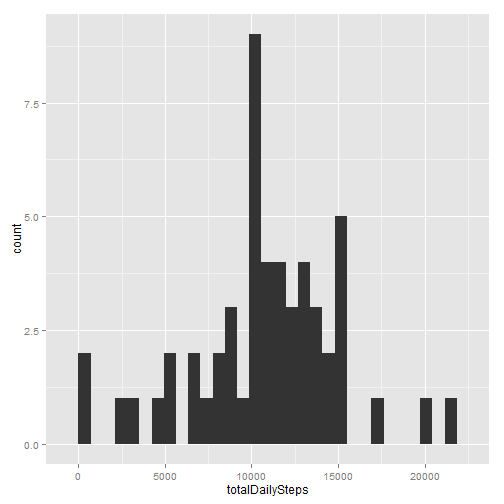
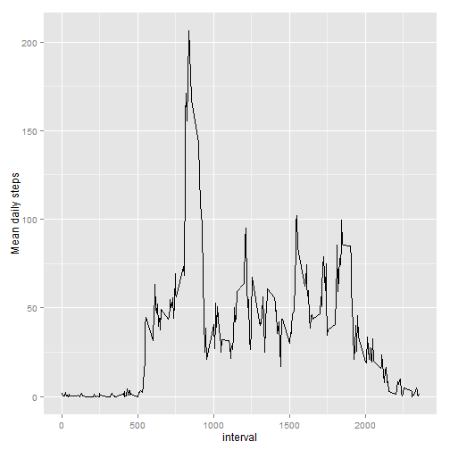
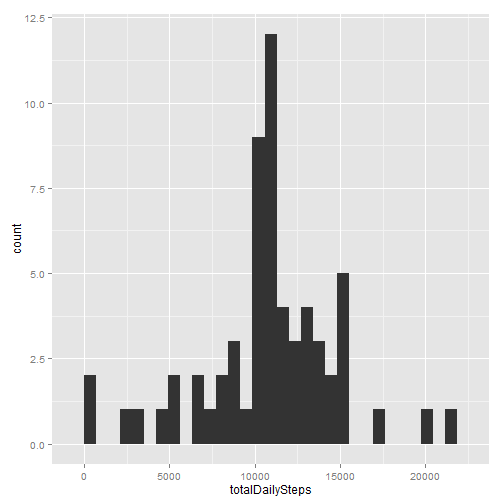
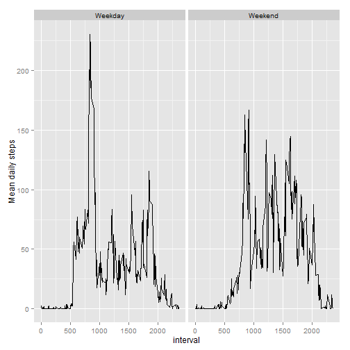

This document details how the analysis of wearable technology has been performed with the aim of answering a number of questions.

The data was obtained on 17/10/2015 from
https://d396qusza40orc.cloudfront.net/repdata%2Fdata%2Factivity.zip

First the file is downloaded and the data are uncompressed 


```r
dest<-"repdata-data-activity"
url<-"https://d396qusza40orc.cloudfront.net/repdata%2Fdata%2Factivity.zip"
if (!file.exists(dest)){
  download.file(url,dest,method="libcurl",mode="wb")
}
unzip(dest)
```

The data are then imported into R and the date/time is formatted


```r
activity<-read.csv("activity.csv")
library(stringr)
activity$datetime<-strptime(paste(activity$date,str_pad(activity$interval,4,pad="0")),format="%Y-%m-%d %H%M")
```

##What is the mean total number of steps taken per day?

```r
totalDailySteps<-tapply(activity$steps,activity$date,sum)
library(ggplot2)
qplot(totalDailySteps)
```

```
## stat_bin: binwidth defaulted to range/30. Use 'binwidth = x' to adjust this.
```

 

The mean number of steps per day is given by

```r
mean(totalDailySteps,na.rm=TRUE)
```

```
## [1] 10766.19
```

The median number of steps per day is given by

```r
median(totalDailySteps,na.rm=TRUE)
```

```
## [1] 10765
```

##What is the average daily activity pattern?

```r
meanDailyStepsbytime<-aggregate(activity$steps,by=list(activity$interval),mean,na.rm=TRUE)
library(ggplot2)
qplot(Group.1,x,data=meanDailyStepsbytime,geom="line",xlab="interval",ylab="Mean daily steps")
```

 

The most active 5 minute interval is

```r
meanDailyStepsbytime[which.max(meanDailyStepsbytime$x),"Group.1"]
```

```
## [1] 835
```

##Inputting missing values

There are 

```r
nrow(activity[is.na(activity$steps),])
```

```
## [1] 2304
```
missing values in the dataset

The missing values will be populated using the mean for the specific 5 minute interval over the entire dataset


```r
library(dplyr)
activity2<-merge(activity,meanDailyStepsbytime,by.x="interval",by.y="Group.1")
activity2[is.na(activity2$steps),]$steps<-activity2[is.na(activity2$steps),]$x
activity<-activity2[,1:4]
```

Now reviewing the changes when the missing values have been populated

```r
totalDailySteps<-tapply(activity$steps,activity$date,sum)
library(ggplot2)
qplot(totalDailySteps)
```

```
## stat_bin: binwidth defaulted to range/30. Use 'binwidth = x' to adjust this.
```

 

The mean number of steps per day is given by

```r
mean(totalDailySteps)
```

```
## [1] 10766.19
```

The median number of steps per day is given by

```r
median(totalDailySteps)
```

```
## [1] 10766.19
```

##Are there differences in activity patterns between weekdays and weekends?

```r
activity$weekday<-weekdays(activity$datetime)
activity$weekdaytype<-as.factor(with(activity, ifelse(weekday %in% c("Saturday","Sunday"),"Weekend","Weekday")))
meanDailyStepsbyweekdaytime<-aggregate(activity$steps,by=list(activity$weekdaytype,activity$interval),mean)
qplot(Group.2,x,data=meanDailyStepsbyweekdaytime,geom="line",xlab="interval",ylab="Mean daily steps",facets=.~Group.1)
```

 


